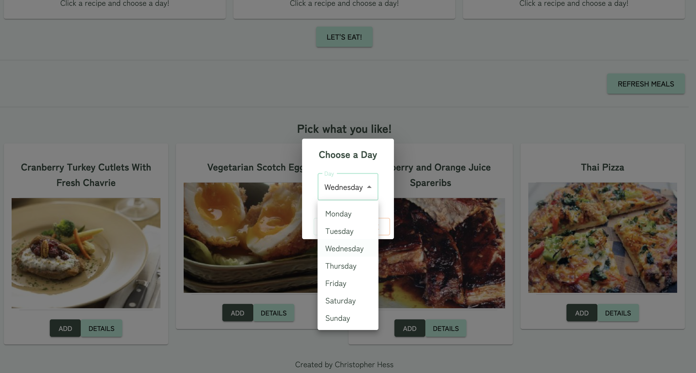
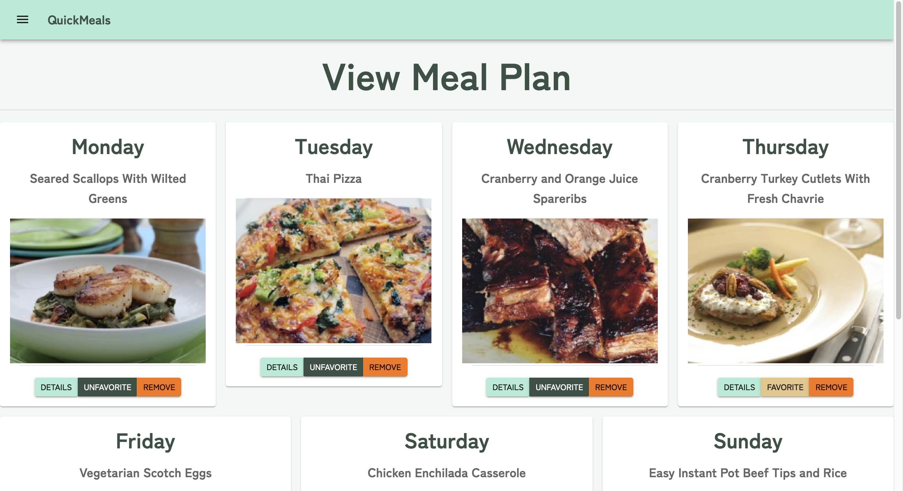

# QuickMeals

## Description

_Duration: 2 Week Sprint_

Can’t decide what’s for dinner? QuickMeals is a random recipe picker/meal planner App with help from the spoonacular API. If you just want to quickly find a recipe without thinking, you can randomly search for recipes on the Recipe Generator page. If not, you can plan meals for one day or the entire week. You can then take that meal plan and generate a shopping list. If you find a recipe that you love, you can also save it to your favorites.

## Now Deployed On Heroku!

Important: I am using the free version of Heroku. The app goes to sleep if it has not been opened for a while. Please give it the initial load a chance.

[Check out my app!](https://hess-quickmeals.herokuapp.com/)

## Scope Document
See: [Scope Document](https://docs.google.com/document/d/1-JiniI-LnAbEoI7cYLXNBrbgpZj1vpY2_2h-W1HLSms/edit#heading=h.vhvkcjgwsn55)

This has the details of all of my initial planning. This includes wireframes for each feature, scheduling estimates for each piece of the project, my server routes, and my technologies used.

## Screen Shot

### How you can pick your Meal Plan

### How you can view your Meal Plan

### Prerequisites

- Any IDE such as VS Code or a web browser, Node.js, postgresql and associated database software.
- This app uses the Spoonacular API and requires an internet connection to enjoy full functionality.
- Also, if running locally, you will need to [register an account](https://spoonacular.com/food-api) and create your own spoonacular API key.

## Installation
1. Fork the repository
2. Ensure that [git is installed](https://git-scm.com/downloads) on your Mac/PC.
2. Copy the SSH link under 'Code'.
3. Enter terminal(Mac) or Git Bash(Windows) and in your desired folder, type 'git clone git@github.com:hesscm/movies-sagas.git'.
4. Open with your preferred IDE.
5. You will need node.js installed. In the repo folder, type "npm install" to install all of the included dependencies.
6. You will also need postgres installed. Install a SQL database titled 'QuickMeals' with the data in the data.sql file.
7. Finally, you need to create a file name called '.env'. Create a new variable called 'SPOONACULAR_API_KEY=yourAPIkey' and insert your API key where it says 'yourAPIkey'.
7. Type "npm run server" to get the server running.
8. Open a new terminal and type "npm run client" to get the react client going.
9. Run the app in the browser at "localhost:3000".
10. A browser window should pop up, otherwise navigate to 'localhost:3000'.

## Usage

1. Create an account or log in as an existing user.
2. You will be redirected to the Recipe Generator page, where you can select and save a random recipe.
3. Navigation links are currently available at the top of the page.
4. The 'Pick Your Meals' page allows you to pick and refresh new recipes and add them to a day of the week.
5. The 'View Meal Plan' page shows all of your current meals. Here you can favorite a meal, remove a meal, or generate a shopping list.
6. The 'Shopping List' page shows you ingredients for either, individual days of the week, or combined ingredients for the entire meal plan.
7. The 'Favorites' page shows all of your saved meals as a long-running history that you can access at any time.
8. The 'User/Dashboard' page is TBD.

## Built With

HTML, CSS, JavaScript, Node.js, Postgres, SQL, React, Redux, Redux-Saga, Material-UI, Passport, Axios, Heroku, Moment.js, Spoonacular API.

## Acknowledgement
Thanks to [Prime Digital Academy](www.primeacademy.io) who equipped and helped me to make this application a reality. (Shout out to my instructor, Chris Black!)

## Support
If you have suggestions or issues, please email me at [chrishessmusic@gmail.com]
